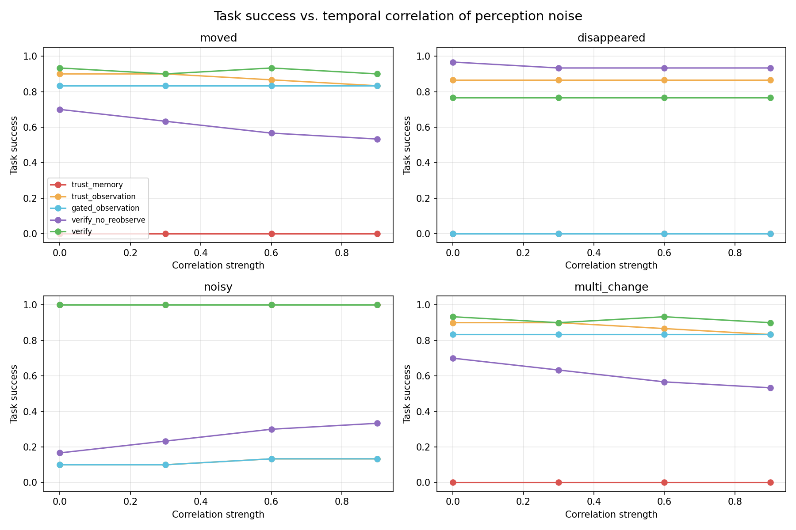
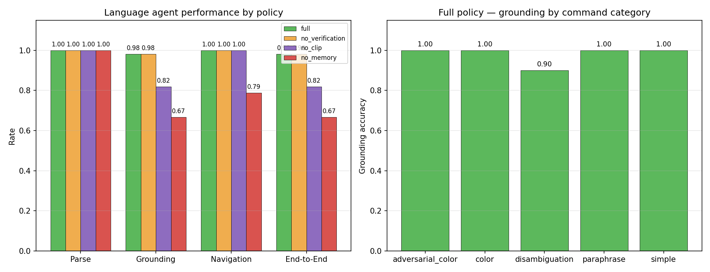

# Reliable Spatial Memory for a Language-Grounded Embodied Agent

**Core contribution:** a verification layer for reliable spatial memory under
noisy and changing observations. **Extension:** language-grounded navigation
via CLIP.

An embodied agent that explores a simulated indoor environment, builds a persistent confidence-weighted spatial memory of objects and their relationships, and uses that memory to navigate to goal objects. When the environment changes or perception is noisy, the agent detects the conflict between memory and observation, gathers additional evidence, and only then updates its belief.


---

## Motivation

Most embodied agents treat memory as ground truth. When the environment changes or perception is noisy, they keep acting on stale beliefs and fail.

This project studies a small, concrete version of that problem:

> **Can an agent detect when its spatial memory has become unreliable, and recover before the failure propagates into task failure?**

---

## System

```
   GridWorld ──observe()──▶  Perception  ──relations──▶  SpatialGraph
   (rooms,                   (FOV cone                 + per-relation
    objects,                  or RGB render +           confidence,
    agent)                    color detector)           decay, reinforcement
                                                              │
                                                              ▼
   Agent ◀──navigate──  Memory  ◀──update──  Verification
   (task:                              ◀──re-observe──  (conflict detection +
    reach target)                                       policy: accept / keep /
                                                        re-observe / uncertain)
```

Three interchangeable perception pipelines feed the same memory layer:

- **Geometric FOV cone** (main experiments): 8-cell range, 120° forward cone.
- **RGB render + color detector** (`scripts/run_visual_demo.py`): top-down image → color segmentation → connected components.
- **MobileNet-SSD detector** (`scripts/run_mobilenet_demo.py`): a real pretrained CNN detector run through OpenCV DNN. Loads and executes correctly, but produces zero detections on the synthetic render due to the domain gap between VOC-trained detectors and simplified scenes — documented as a limitation.

All three produce `Frame` objects consumed by an identical memory and verification pipeline. The architecture is perception-agnostic.

---

## Experiment

**Core evaluation: 6,400 runs across two noise models.**

- **Main:** 5 policies × 4 scenarios × 4 noise levels × 50 seeds = 4,000 runs
- **Correlated:** 5 policies × 4 scenarios × 4 correlation strengths × 30 seeds = 2,400 runs

**Extension: 1,320 additional runs** for the language-grounding ablation.

### Policies

| Policy | Description |
|---|---|
| `trust_memory` | Never updates memory. Baseline. |
| `trust_observation` | Detects conflicts, accepts every observation. |
| `gated_observation` | Accepts only high-confidence observations. |
| `verify_no_reobserve` | Ablation: accepts conflicts without re-observation. |
| **`verify`** | **Multi-sample confidence-weighted voting (N=5).** |

### Scenarios

| Scenario | What changes |
|---|---|
| `moved` | Target relocated to a new surface. |
| `disappeared` | Target removed from the scene. |
| `noisy` | No real change; the first observation falsely reports a move. |
| `multi_change` | Two objects moved simultaneously. |

Noise levels (per-observation miss rate): 0.0, 0.10, 0.20, 0.30.

### Task

For every run:

1. The agent explores the environment for 150 steps, building spatial memory.
2. The scenario is applied (object moved, removed, or falsely reported).
3. The agent observes the scene once and runs its policy.
4. The agent navigates to the target's *memory* location.
5. Success is measured against ground truth (agent within 2 cells of the true target, or correctly believing the target is gone).

---

## Results (miss rate = 0.30, 50 seeds)

| Policy | moved | disappeared | noisy | multi_change |
|---|---|---|---|---|
| trust_memory | 0.00 | 0.00 | 1.00 | 0.00 |
| trust_observation | 0.60 | 0.72 | 0.34 | 0.60 |
| gated_observation | 0.50 | 0.00 | 0.32 | 0.50 |
| verify_no_reobserve | 0.46 | 0.76 | 0.48 | 0.46 |
| **verify** | **0.84** | **0.76** | **1.00** | **0.76** |

### Findings

1. **Verification is decisive under false observations.**
   On `noisy`, `verify` reaches 1.00 task success vs. 0.48 for the best non-trivial baseline. It correctly rejects the spurious move by voting across multiple samples rather than trusting any single observation.

2. **Verification is Pareto-optimal.**
   Across all four scenarios, `verify` is never beaten by any baseline: it wins on `moved` (0.84 vs 0.60), `noisy` (1.00 vs 0.48), and `multi_change` (0.76 vs 0.60), and ties the best ablation on `disappeared` (0.76).

3. **The cost is bounded.**
   Verification uses ~6–10 additional observations per episode — a small, bounded overhead for protection against false observations.

4. **The gain comes from re-observation.**
   Removing it (`verify_no_reobserve`) drops performance on the noisy scenario from 1.00 to 0.48 — matching the naive baseline. Conflict detection alone is insufficient; evidence accumulation is what works.

### Sensitivity

At low noise, policies converge. As noise increases, `verify` pulls ahead on the noisy scenario while remaining competitive elsewhere.

### Summary bars


### Ablation

Removing multi-sample re-observation from the full pipeline:

| Scenario | verify | verify_no_reobserve |
|---|---|---|
| moved | 0.84 | 0.46 |
| disappeared | 0.76 | 0.76 |
| **noisy** | **1.00** | **0.48** |
| multi_change | 0.76 | 0.46 |

Re-observation is the mechanism that provides robustness to false observations.


### Correlated Noise

The main experiment assumes independent noise per observation. Real detectors exhibit temporally correlated failures (occlusion, lighting, bad frames). We model this with an Ornstein-Uhlenbeck process (`perception/correlated_noise.py`) and rerun the experiment across correlation strengths 0.0–0.9.

Results at correlation strength 0.9:

| Policy | moved | disappeared | noisy | multi_change |
|---|---|---|---|---|
| trust_memory | 0.00 | 0.00 | 1.00 | 0.00 |
| trust_observation | 0.83 | 0.87 | 0.13 | 0.83 |
| gated_observation | 0.83 | 0.00 | 0.13 | 0.83 |
| verify_no_reobserve | 0.53 | **0.93** | 0.33 | 0.53 |
| **verify** | **0.90** | 0.77 | **1.00** | **0.90** |

**Finding:** Multi-sample voting retains its advantage on the `noisy` scenario under high correlation (1.00 vs 0.33), but **loses its advantage on the `disappeared` scenario** (0.77 vs 0.93 for `verify_no_reobserve`). This failure mode reproduces across both experiments. Temporally correlated noise breaks the independence assumption behind voting — when the detector enters a sustained error state, consecutive samples share the same false signal. This motivates adaptive verification that detects correlation and adjusts its strategy.



---

### Extension: Language-Grounded Navigation

This extension applies the memory and verification architecture to natural-language
command execution. It is presented as a demonstration of generality rather than
a validation of the main verification hypothesis.

A language layer extends the agent with natural-language command execution
(`src/rsm/language/`). Commands like *"go to the red mug"* are parsed with
spaCy, matched against verified spatial memory, and grounded to a specific
object via CLIP (ViT-B/32).

Pipeline:

```
"Go to the red mug"
       ↓
  spaCy parser           → {action: navigate, object_type: Mug, color: red}
       ↓
  Memory retrieval       → candidates from verified spatial memory
       ↓
  CLIP grounding         → text-image similarity on rendered crops
       ↓
  Navigate + scan        → move to remembered location, scan 360°
```

Ablation (11 commands × 3 scenarios × 10 seeds × 4 policies = 1,320 runs):

| Policy | Grounding | End-to-End |
|---|---|---|
| **full** | **0.98** | **0.98** |
| no_verification | 0.98 | 0.98 |
| no_clip | 0.82 | 0.82 |
| no_memory | 0.67 | 0.67 |

**Findings:**

1. **CLIP grounding is essential.** Removing image-text similarity drops
   grounding accuracy from 0.98 to 0.82 — CLIP disambiguates objects that
   share a base type (`Mug` vs `RedMug`) in a way that pure type-matching
   cannot.

2. **Spatial memory is essential.** Removing memory drops grounding
   accuracy to 0.67 — without memory, the agent cannot retrieve candidates
   for commands whose targets are outside the current field of view.

3. **The verification layer does not transfer to short-horizon tasks.**
   `full` and `no_verification` produce identical results because the
   language task generates short, localized observations and the verifier
   (designed for long exploration in the main experiments) rarely fires
   meaningful updates. Extending memory verification to command-driven
   tasks is a natural direction for future work.



---

## Design Notes

**Confidence semantics.** An early implementation treated an absent object as *"weak evidence"*, causing the verifier to keep stale memory on removal. The correct interpretation is that a direct look at a remembered location that fails to find the object is *moderate evidence of absence* — strong enough to trigger re-observation, not strong enough to immediately overwrite memory. Setting `observed_confidence = 0.55` for absence (instead of `0.0`) resolved the disappeared-scenario failure.

**Perception-agnostic memory.** The memory and verification modules take `Frame` objects and never inspect the underlying simulator or image. The same modules were driven by the geometric FOV cone, the RGB color detector, and the MobileNet-SSD detector without modification.

**Reproducibility.** String hashing is fixed via a deterministic hash function and `PYTHONHASHSEED=0`. Two consecutive runs of the main experiment produce identical results.

---

## Repository Structure

```
reliable-spatial-memory/
├── README.md
├── LICENSE
├── .gitignore
├── environment.yml
├── requirements.txt
│
├── data/
│   ├── memory_step2.json
│   └── README.md
│
├── models/
│   ├── README.md
│   ├── MobileNetSSD_deploy.prototxt       # gitignored
│   └── mobilenet_iter_73000.caffemodel    # gitignored (~23 MB)
│
├── results/
│   ├── figures/
│   │   ├── sensitivity.png
│   │   ├── summary_bars.png
│   │   ├── ablation.png
│   │   ├── correlated_sensitivity.png
│   │   ├── language_results.png
│   │   ├── mobilenet_view.png
│   │   └── agent_view.png
│   └── tables/
│       ├── main_experiment.csv
│       ├── main_experiment.md
│       ├── correlated_results.csv
│       ├── correlated_results.md
│       ├── language_results.csv
│       └── language_results.md
│
├── scripts/
│   ├── run_demo.py                  # environment sanity check
│   ├── run_memory_demo.py           # memory construction walkthrough
│   ├── run_full_demo.py             # baseline vs verify, single scenario
│   ├── run_visual_demo.py           # image → color detector → memory
│   ├── run_mobilenet_demo.py        # image → MobileNet-SSD → memory
│   ├── run_main_experiment.py       # main 4000-run experiment
│   ├── run_correlated_experiment.py # correlated-noise experiment
│   ├── run_language_demo.py         # single-command language demo
│   ├── run_language_experiment.py   # 4-policy language ablation
│   ├── make_final_figures.py        # main figures
│   └── make_language_figures.py     # language figure
│
├── src/
│   └── rsm/
│       ├── environment/            # grid world, scene
│       ├── perception/             # observation, relations, noise, renderer,
│       │                           #   visual_detector, mobilenet_detector,
│       │                           #   correlated_noise
│       ├── memory/                 # spatial graph, nodes, edges, confidence, updater
│       ├── verification/           # conflict detector, verifier
│       ├── agent/                  # navigator
│       ├── tasks/                  # navigate task
│       ├── evaluation/             # scenarios, policies
│       └── language/               # parser, candidates, CLIP grounder,
│                                   #   language agent, evaluation
│
└── tests/
    ├── __init__.py
    ├── test_memory.py
    └── test_language.py
```

---

## Reproducing

### Setup

```bash
conda create -n spatial python=3.10 -y
conda activate spatial
pip install -r requirements.txt
```

### Run everything in order

```bash
# ---- Core evaluation: spatial memory ----
# 1. Sanity check the environment
python scripts/run_demo.py

# 2. Watch memory construction
python scripts/run_memory_demo.py

# 3. Side-by-side baseline vs verify (single scenario)
python scripts/run_full_demo.py

# 4. Image-based perception demo (color detector)
python scripts/run_visual_demo.py

# 5. MobileNet-SSD demo (documents domain gap)
python scripts/run_mobilenet_demo.py

# 6. Main experiment (~5-8 min, 4000 runs)
python scripts/run_main_experiment.py

# 7. Correlated noise experiment (~4-6 min, 2400 runs)
python scripts/run_correlated_experiment.py

# 8. Regenerate all main figures
python scripts/make_final_figures.py

# ---- Extension: language-grounded navigation ----
# 9. Single-command demo (first run downloads CLIP)
python scripts/run_language_demo.py

# 10. Language grounding experiment (~3-5 min, 1320 runs)
python scripts/run_language_experiment.py

# 11. Language figure
python scripts/make_language_figures.py
```

### Results files

- Raw per-run results: `results/tables/main_experiment.csv`, `results/tables/correlated_results.csv`
- Summary tables: `results/tables/main_experiment.md`, `results/tables/correlated_results.md`
- Figures: `results/figures/*.png`

### Tests

```bash
pytest tests/ -v
```

---

## Requirements

```
numpy>=1.24,<2.0
matplotlib>=3.7
pytest>=7.4
opencv-python>=4.8
sentence-transformers>=2.2
spacy>=3.7
Pillow>=9.0
```

Python 3.10. No GPU required. Runs on a laptop. First run downloads the
CLIP model (~150 MB) and spaCy model (~13 MB) to local caches.

---

## Limitations

- **2D grid world.** Discrete positions; observations drawn from ground truth with synthetic noise. Not a photorealistic simulator.
- **Uncorrelated noise in the main experiment.** Miss rate is independent per observation, which favors multi-sample voting. The correlated-noise experiment addresses this directly — see the Correlated Noise subsection above.
- **Hand-tuned confidence model.** Decay and reinforcement constants are fixed, not learned.
- **Fixed verification budget.** N=5 samples per conflict; adaptive budgets are future work.
- **Small state space.** Two rooms, eight objects. Scaling to realistic environments would require a scalable scene-graph backend.
- **Pretrained detector domain gap.** A pretrained MobileNet-SSD detector was integrated via OpenCV DNN and loads/runs correctly, but produces zero detections on the synthetic top-down render. This illustrates the well-known domain gap between natural-image detectors and simplified scene representations. Fine-tuning on synthetic data is left as future work.
- **Verification does not transfer to short-horizon tasks.** The multi-sample
  verification policy is decisive in long exploration episodes but fires
  rarely in the language task, where the agent observes short, localized
  scenes. This is documented as a limitation and motivates adaptive
  verification in future work.
- **Ground-truth navigation coordinates.** The experiment evaluates whether
  memory selects the correct target location, but the navigator obtains the
  coordinates of that selected location from the simulated environment
  rather than from a fully memorized geometric representation. Extending
  memory to store location coordinates is future work.

These constraints are deliberate — the goal is to isolate the memory-reliability problem, not to build a complete embodied AI system.

---

## Future Work

- **Adaptive verification.** Choose the number of re-observations based on estimated local noise and correlation.
- **Learned confidence.** Replace heuristic decay and reinforcement with a model that predicts memory reliability from observation history.
- **Photorealistic simulation.** Port the memory and verification layers onto AI2-THOR or Habitat without changing their interfaces.
- **Detector fine-tuning.** Fine-tune a pretrained detector on synthetic top-down renders to close the domain gap.

---

## License

MIT — see `LICENSE`.