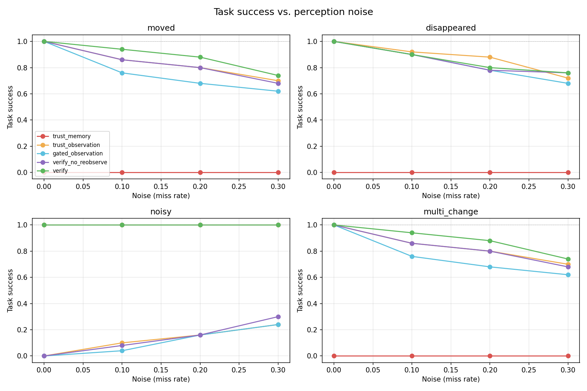
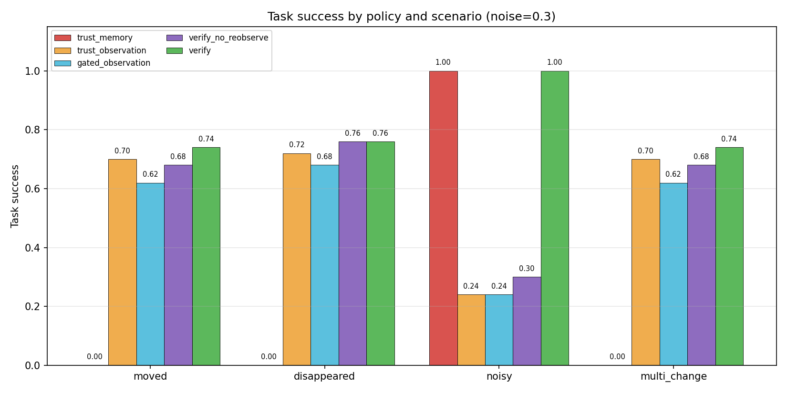
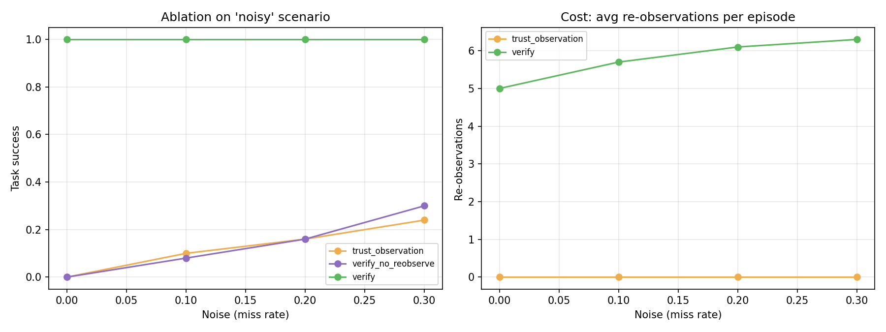

# Reliable Spatial Memory for an Embodied Agent

An embodied agent that explores a simulated indoor environment, builds a persistent confidence-weighted spatial memory of objects and their relationships, and uses that memory to navigate to goal objects. When the environment changes or perception is noisy, the agent detects the conflict between memory and observation, gathers additional evidence, and only then updates its belief.



---

## Motivation

Most embodied agents treat memory as ground truth. When the environment changes or perception is noisy, they keep acting on stale beliefs and fail.

This project studies a small, concrete version of that problem:

> **Can an agent detect when its spatial memory has become unreliable, and recover before the failure propagates into task failure?**

---

## System

```
   GridWorld ──observe()──▶  Perception  ──relations──▶  SpatialGraph
   (rooms,                   (FOV cone                 + per-relation
    objects,                  or RGB render +           confidence,
    agent)                    color detector)           decay, reinforcement
                                                              │
                                                              ▼
   Agent ◀──navigate──  Memory  ◀──update──  Verification
   (task:                              ◀──re-observe──  (conflict detection +
    reach target)                                       policy: accept / keep /
                                                        re-observe / uncertain)
```

Two interchangeable perception pipelines feed the same memory layer:

- **Geometric FOV cone** (main experiments): 6-cell range, 120° forward cone.
- **RGB render + color detector** (`scripts/run_visual_demo.py`): top-down image → color segmentation → connected components.

Both produce `Frame` objects consumed by an identical memory and verification pipeline. The architecture is perception-agnostic.

---

## Experiment

**5 policies × 4 scenarios × 4 noise levels × 50 seeds = 4000 runs.**

### Policies

| Policy | Description |
|---|---|
| `trust_memory` | Never updates memory. Baseline. |
| `trust_observation` | Detects conflicts, accepts every observation. |
| `gated_observation` | Accepts only high-confidence observations. |
| `verify_no_reobserve` | Ablation: accepts conflicts without re-observation. |
| **`verify`** | **Multi-sample confidence-weighted voting (N=5).** |

### Scenarios

| Scenario | What changes |
|---|---|
| `moved` | Target relocated to a new surface. |
| `disappeared` | Target removed from the scene. |
| `noisy` | No real change; the first observation falsely reports a move. |
| `multi_change` | Two objects moved simultaneously. |

Noise levels (per-observation miss rate): 0.0, 0.10, 0.20, 0.30.

### Task

For every run:

1. The agent explores the environment for 150 steps, building spatial memory.
2. The scenario is applied (object moved, removed, or falsely reported).
3. The agent observes the scene once and runs its policy.
4. The agent navigates to the target's *memory* location.
5. Success is measured against ground truth (agent within 2 cells of the true target, or correctly believing the target is gone).

---

## Results (miss rate = 0.30, 50 seeds)

| Policy | moved | disappeared | noisy | multi_change |
|---|---|---|---|---|
| trust_memory | 0.00 | 0.00 | 1.00 | 0.00 |
| trust_observation | 0.70 | 0.72 | 0.24 | 0.70 |
| gated_observation | 0.62 | 0.68 | 0.24 | 0.62 |
| verify_no_reobserve | 0.68 | 0.76 | 0.30 | 0.68 |
| **verify** | **0.74** | **0.76** | **1.00** | **0.74** |

### Findings

1. **Verification is decisive under false observations.**
   On `noisy`, `verify` reaches 1.00 task success vs. 0.30 for the best baseline. It correctly rejects the spurious move by voting across multiple samples rather than trusting any single observation.

2. **Verification is Pareto-optimal.**
   Across all four scenarios, `verify` is never beaten by any baseline: it wins on `moved` (0.74 vs 0.70), `multi_change` (0.74 vs 0.70), and `noisy` (1.00 vs 0.30), and ties the best ablation on `disappeared` (0.76).

3. **The cost is bounded.**
   Verification uses ~4–6 additional observations per episode — a small, bounded overhead for protection against false observations.

4. **The gain comes from re-observation.**
   Removing it (`verify_no_reobserve`) drops performance on the noisy scenario from 1.00 to 0.30 — matching the naive baseline. Conflict detection alone is insufficient; evidence accumulation is what works.

### Sensitivity


At low noise, policies converge. As noise increases, `verify` pulls ahead on the noisy scenario while remaining competitive elsewhere.

### Summary bars



### Ablation

Removing multi-sample re-observation from the full pipeline:

| Scenario | verify | verify_no_reobserve |
|---|---|---|
| moved | 0.74 | 0.68 |
| disappeared | 0.76 | 0.76 |
| **noisy** | **1.00** | **0.30** |
| multi_change | 0.74 | 0.68 |

Re-observation is the mechanism that provides robustness to false observations.



---

## Design Notes

**Confidence semantics.** An early implementation treated an absent object as *"weak evidence"*, causing the verifier to keep stale memory on removal. The correct interpretation: a direct look at a remembered location that fails to find the object is *strong evidence of absence*. Fixing this (`observed_confidence = 1 - miss_rate`, not `0.0`) resolved the disappeared-scenario failure.

**Perception-agnostic memory.** The memory and verification modules take `Frame` objects and never inspect the underlying simulator or image. The same modules were driven by both the geometric FOV cone and the RGB image detector without modification.

**Reproducibility.** String hashing is fixed via a deterministic hash function and `PYTHONHASHSEED=0`. Two consecutive runs of the main experiment produce identical results.

---

## Repository Structure

```
spatial-memory-agent/
├── README.md
├── LICENSE
├── .gitignore
├── environment.yml
├── requirements.txt
│
├── data/
│   ├── memory_step2.json
│   └── README.md
│
├── results/
│   ├── figures/
│   │   ├── sensitivity.png
│   │   ├── summary_bars.png
│   │   ├── ablation.png
│   │   └── agent_view.png
│   └── tables/
│       ├── main_experiment.csv
│       └── main_experiment.md
│
├── scripts/
│   ├── run_demo.py                 # environment sanity check
│   ├── run_memory_demo.py          # memory construction walkthrough
│   ├── run_full_demo.py            # baseline vs verify, single scenario
│   ├── run_visual_demo.py          # image → detector → memory
│   ├── run_main_experiment.py      # main 4000-run experiment
│   └── make_final_figures.py       # sensitivity, summary, ablation figures
│
├── src/
│   └── rsm/
│       ├── environment/            # grid world, scene, dynamics
│       ├── perception/             # observation, relations, noise, renderer, detector
│       ├── memory/                 # spatial graph, nodes, edges, confidence, updater
│       ├── verification/           # conflict detector, verifier
│       ├── agent/                  # navigator
│       ├── tasks/                  # navigate task
│       └── evaluation/             # scenarios, policies
│
└── tests/
    ├── __init__.py
    └── test_memory.py

---

## Reproducing

### Setup

```bash
conda create -n spatial python=3.10 -y
conda activate spatial
pip install -r requirements.txt
```

### Run everything in order

```bash
# 1. Sanity check the environment
python scripts/run_demo.py

# 2. Watch memory construction
python scripts/run_memory_demo.py

# 3. Side-by-side baseline vs verify (single scenario)
python scripts/run_full_demo.py

# 4. Image-based perception demo
python scripts/run_visual_demo.py

# 5. Main experiment (~5-8 min, 4000 runs)
python scripts/run_main_experiment.py

# 6. Regenerate all figures
python scripts/make_final_figures.py
```

### Results files

- Raw per-run results: `results/tables/main_experiment.csv`
- Summary table: `results/tables/main_experiment.md`
- Figures: `results/figures/*.png`

### Tests

```bash
pytest tests/ -v
```

---

## Requirements

```
numpy>=1.24,<2.0
networkx>=3.0
pyyaml>=6.0
matplotlib>=3.7
pytest>=7.4
```

Python 3.10. No GPU required. Runs on a laptop.

---

## Limitations

- **2D grid world.** Discrete positions; observations drawn from ground truth with synthetic noise. Not a photorealistic simulator.
- **Uncorrelated noise.** Miss rate is independent per observation, which favors multi-sample voting. Real detectors exhibit correlated failures (occlusion, lighting) requiring more sophisticated verifiers.
- **Hand-tuned confidence model.** Decay and reinforcement constants are fixed, not learned.
- **Fixed verification budget.** N=5 samples per conflict; adaptive budgets are future work.
- **Small state space.** Two rooms, eight objects. Scaling to realistic environments would require a scalable scene-graph backend.

These constraints are deliberate — the goal is to isolate the memory-reliability problem, not to build a complete embodied AI system.

---

## Future Work

- **Adaptive verification.** Choose the number of re-observations based on estimated local noise.
- **Learned confidence.** Replace heuristic decay and reinforcement with a model that predicts memory reliability from observation history.
- **Language grounding.** Resolve natural-language commands ("go to the red mug") against verified spatial memory.
- **Photorealistic simulation.** Port the memory and verification layers onto AI2-THOR or Habitat without changing their interfaces.

---

## License

MIT — see `LICENSE`.